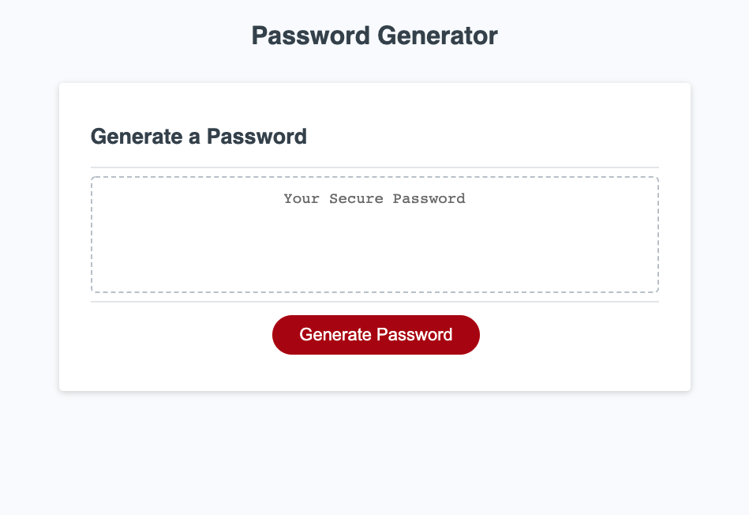

# Password Generator

This is a web application that creates a password given a set of prompts. One can decide if they want lowercase letters, uppercase letters, numbers, and special characters. It can create passwords from 8 to 128 characters long, and it rejects invalid input.

## Deployment

https://josh2100.github.io/password-generator/

## Screenshot

